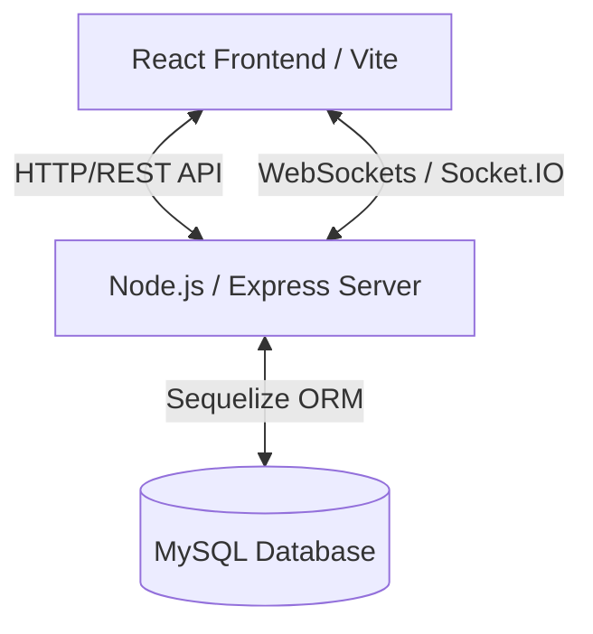
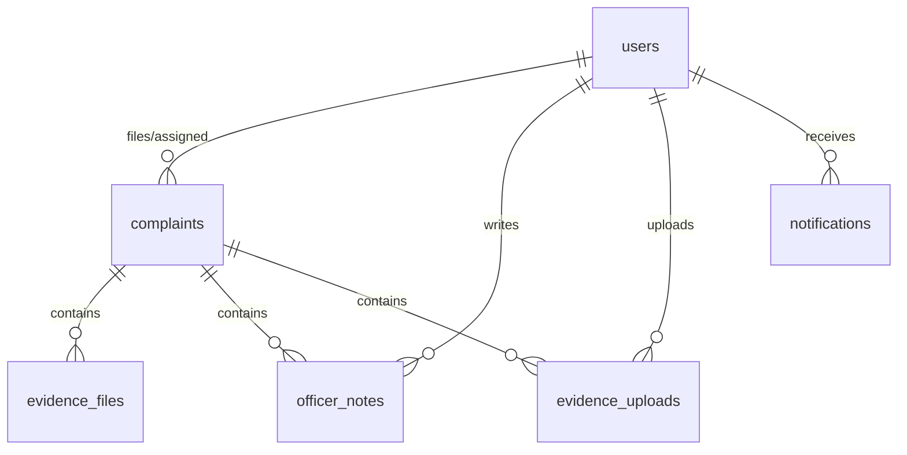

# 🛡️ Cyber Crime Complaint Portal - Technical & Operational Project Report

## 1. Executive Summary
The **Cyber Crime Complaint Portal** is a secure, role-based, real-time web application designed to streamline the reporting, tracking, investigation, and resolution of cyber crimes. The system bridges the gap between citizens (who can file complaints officially or anonymously) and law enforcement (officers and administrators) through real-time communication, structured investigation tracking, and modern data-driven analytics.

The key highlight of the system is the **Real-Time Notification Subsystem**, built using **Socket.IO**. This subsystem ensures that citizens, officers, and administrators are instantly notified of crucial workflow updates (e.g., status changes, case assignments, or evidence uploads) without page refreshes.

---

## 2. Project Architecture & Technology Stack
The application is designed using a modern decoupled client-server architecture:



*   **Frontend**: 
    *   **React 19 (Vite)**: Quick rendering, modular component design.
    *   **React Router**: Directs role-based navigation.
    *   **Axios**: Manages HTTP request/response interceptors and communication with the API.
    *   **Framer Motion**: Delivers smooth transitions and cyber-themed glassmorphism animations.
    *   **Socket.IO Client**: Establishes persistent real-time bi-directional connection.
    *   **React Hot Toast**: Displays premium real-time toast alert popups.
*   **Backend**:
    *   **Node.js & Express.js**: Handles asynchronous requests, middleware verification, and routing.
    *   **JWT & bcryptjs**: Standardizes user authorization, token generation, and secure password hashing.
    *   **Socket.IO Server**: Manages role-based rooms, socket states, and connection handshakes.
*   **Database**:
    *   **MySQL Server (8.4+)**: Relational storage.
    *   **Sequelize ORM**: Configures schemas, model associations, transactions, and seeding protocols.

---

## 3. Database Architecture & Schema
The relational database comprises six tables configured with Sequelize:



### Table Schemas:

#### A. Users Table (`users`)
Stores profile and credentials of citizens, officers, and administrators.
*   `id` (BIGINT, Primary Key, Auto Increment)
*   `name` (VARCHAR, Required)
*   `email` (VARCHAR, Unique, Required)
*   `phone` (VARCHAR, Required)
*   `password` (VARCHAR, Required)
*   `role` (ENUM: `'ROLE_CITIZEN'`, `'ROLE_OFFICER'`, `'ROLE_ADMIN'`, Default: `'ROLE_CITIZEN'`)
*   `status` (ENUM: `'ACTIVE'`, `'DISABLED'`, Default: `'ACTIVE'`)

#### B. Complaints Table (`complaints`)
Represents the core complaint filed by the citizen.
*   `id` (BIGINT, Primary Key, Auto Increment)
*   `complaintId` (VARCHAR, Unique, field: `complaint_id`) - Format: `COMP-XXXX`
*   `title` (VARCHAR, Required)
*   `category` (VARCHAR, Required)
*   `priority` (ENUM: `'LOW'`, `'MEDIUM'`, `'HIGH'`, Required)
*   `description` (TEXT, Optional)
*   `incidentDate` (DATEONLY, Required, field: `incident_date`)
*   `status` (ENUM: `'SUBMITTED'`, `'UNDER_REVIEW'`, `'INVESTIGATING'`, `'RESOLVED'`, `'REJECTED'`, Default: `'SUBMITTED'`)
*   `location` (VARCHAR, Default: `'Unknown'`)
*   `userId` (BIGINT, Foreign Key referencing `users(id)`, field: `user_id`)
*   `officerId` (BIGINT, Foreign Key referencing `users(id)`, Nullable, field: `officer_id`)

#### C. Evidence Files Table (`evidence_files`)
Files uploaded by the citizen during complaint submission.
*   `id` (BIGINT, Primary Key, Auto Increment)
*   `fileName` (VARCHAR, Required, field: `file_name`)
*   `filePath` (VARCHAR, Required, field: `file_path`)
*   `uploadedAt` (TIMESTAMP, Default: NOW, field: `uploaded_at`)
*   `complaintId` (BIGINT, Foreign Key referencing `complaints(id)`, field: `complaint_id`)

#### D. Officer Notes Table (`officer_notes`)
Internal documentation compiled by officers during investigations.
*   `id` (BIGINT, Primary Key, Auto Increment)
*   `note` (TEXT, Required)
*   `officerId` (BIGINT, Foreign Key referencing `users(id)`, field: `officer_id`)
*   `complaintId` (BIGINT, Foreign Key referencing `complaints(id)`, field: `complaint_id`)
*   `officerName` (VARCHAR, field: `officer_name`)
*   `createdAt` (TIMESTAMP, Default: NOW, field: `created_at`)

#### E. Evidence Uploads Table (`evidence_uploads`)
Files uploaded by officers during the active investigation phase.
*   `id` (BIGINT, Primary Key, Auto Increment)
*   `fileName` (VARCHAR, Required, field: `file_name`)
*   `filePath` (VARCHAR, Required, field: `file_path`)
*   `uploadedAt` (TIMESTAMP, Default: NOW, field: `uploaded_at`)
*   `complaintId` (BIGINT, Foreign Key referencing `complaints(id)`, field: `complaint_id`)
*   `officerId` (BIGINT, Foreign Key referencing `users(id)`, field: `officer_id`)

#### F. Notifications Table (`notifications`)
Stores historical log of notifications sent to users.
*   `id` (BIGINT, Primary Key, Auto Increment)
*   `userId` (BIGINT, Foreign Key referencing `users(id)`, field: `user_id`)
*   `title` (VARCHAR, Required)
*   `message` (TEXT, Required)
*   `type` (ENUM: `'INFO'`, `'WARNING'`, `'SUCCESS'`, `'ERROR'`, Default: `'INFO'`)
*   `isRead` (BOOLEAN, Default: `false`, field: `is_read`)
*   `createdAt` (TIMESTAMP, Default: NOW)

---

## 4. Real-Time Notification System (Socket.IO)
The portal implements an event-driven messaging gateway connecting frontend users to the backend server.

### A. Socket Room Strategy
When a client connects, the system authenticates the user via JWT. Upon verification, the user joins specialized communication channels:
1.  **Direct Room (`user_<userId>`)**: Allows direct, secure targeting of notifications to specific citizens or officers.
2.  **Role Room (`admin` / `officer` / `citizen`)**: Allows general role-based broadcasts (e.g., notifying all Admins of a new complaint).

```
                 +--------------------------+
                 |    Socket Connection     |
                 +------------+-------------+
                              |
                     [ JWT Authenticated ]
                              |
               +--------------+--------------+
               |                             |
     [ Join Direct Room ]            [ Join Role Room ]
       "user_<userId>"              "admin" / "officer" / "citizen"
```

### B. Event Triggers and Flow

| Event Trigger | DB Action | Recipient Room | Socket Event Payload | Frontend Reaction |
| :--- | :--- | :--- | :--- | :--- |
| **New Complaint Submitted** | Bulk create notifications for all Admins. | `admin` | `"notification"` (type: `INFO`) | Bell badge increments, toast popup shows, dashboard data auto-refreshes. |
| **Complaint Assigned to Officer** | Create notification for the target Officer. | `user_<officerId>` | `"notification"` (type: `WARNING`) | Target officer receives instant notification badge update and toast. |
| **Complaint Status Updated** | Create notification for the Citizen. | `user_<citizenId>` | `"notification"` (type: `INFO` / `WARNING`) | Citizen receives instant status update alert. |
| **Complaint Resolved** | Create notification for the Citizen & Admins. | `user_<citizenId>` & `admin` | `"notification"` (type: `SUCCESS`) | Citizen & Admin dashboards show green success toast. |
| **New Evidence Uploaded** | Create notifications for Officer and/or Admins. | `user_<officerId>` / `admin` | `"notification"` (type: `SUCCESS`) | Dashboards refresh list of files dynamically. |

---

## 5. API Reference Guide

### Auth Routes (`/api/auth`)
*   `POST /register`: Registers new citizens.
*   `POST /login`: Validates credentials, issues JWT.

### Notification Routes (`/api/notifications`)
*   `GET /`: Returns the calling user's historical notifications (ordered by newest).
*   `PUT /:id/read`: Marks a specific notification as read.
*   `DELETE /:id`: Removes a notification from the user's view.

### Complaint Routes (`/api/complaints`)
*   `GET /`: Fetches list of complaints (accessible based on role/auth context).
*   `POST /`: Submits a new complaint (citizens).
*   `PUT /:id`: Modifies complaint status/details.

### Admin Routes (`/api/admin`)
*   `GET /users`: List of all registered citizens.
*   `PUT /users/:id/status`: Toggle citizen account state (`ACTIVE` / `DISABLED`).
*   `GET /officers`: List of all registered officers.
*   `POST /officers`: Register new investigative officers.

---

## 6. Frontend Subsystem & UI Features

### A. Dynamic Theme & Glassmorphism UI
The frontend styling is declared via global custom CSS variables in `src/index.css`, supporting high-fidelity cyber-security colors:
*   `--background`: `#07070d` (ultra-dark deep space)
*   `--accent`: `#00f0ff` (electric cyber cyan)
*   `--primary`: `#0a0a12`
*   `--danger`: `#ff0055` (alert pink-red)
*   `--success`: `#00ff66` (matrix green)
*   `--warning`: `#ffaa00` (amber warning)

Components make extensive use of glassmorphism (`backdrop-filter: blur(12px)`) with glowing drop-shadows.

### B. Core Notification Components

1.  **Socket Context (`src/context/SocketContext.jsx`)**:
    Wraps the application. It handles initial socket connection upon login, updates state on incoming `"notification"` events, triggers custom HTML/CSS toast alerts, and exports core helpers:
    *   `notifications`: List of current notifications.
    *   `unreadCount`: Unread badge count.
    *   `markAsRead(id)`, `markAllAsRead()`, `deleteNotification(id)`, `clearNotifications()`.

2.  **Notification Bell (`src/components/NotificationBell.jsx`)**:
    Placed in the top navigation bar. Includes an animated shake effect (`@keyframes shake`) when there are unread notifications, alongside a red glowing numeric badge. Clicking it toggles the dropdown panel.

3.  **Notification Dropdown (`src/components/NotificationDropdown.jsx`)**:
    Displays notifications in a scrollable, glassmorphic dropdown list with dynamic timestamps, read/unread states, action buttons to mark as read/delete, and a "Clear All" shortcut.

---

## 7. Setup & Running Instructions

### Prerequisites
*   Node.js (v18.x+)
*   MySQL Server (v8.x+)

### Automatic Startup (Windows)
Double-click `start-services.bat` in the root folder. The script will automatically:
1.  Initialize local MySQL storage.
2.  Install dependencies for frontend and backend.
3.  Seed demo credentials:
    *   **Admin**: `admin@gmail.com` / `admin123`
    *   **Citizen**: `user@gmail.com` / `user1234`
    *   **Officer**: `officer@gmail.com` / `officer123`
4.  Launch backend on `localhost:8080` and frontend on `localhost:5173` in the browser.

### Manual Setup
1.  **Frontend & Backend Dependencies**:
    ```bash
    npm install
    cd backend && npm install
    ```
2.  **Database Configuration (`backend/.env`)**:
    Ensure the user, port, and password match your local database settings.
3.  **Launch Backend Server**:
    ```bash
    cd backend
    npm run dev
    ```
4.  **Launch Frontend Application**:
    ```bash
    npm run dev
    ```
